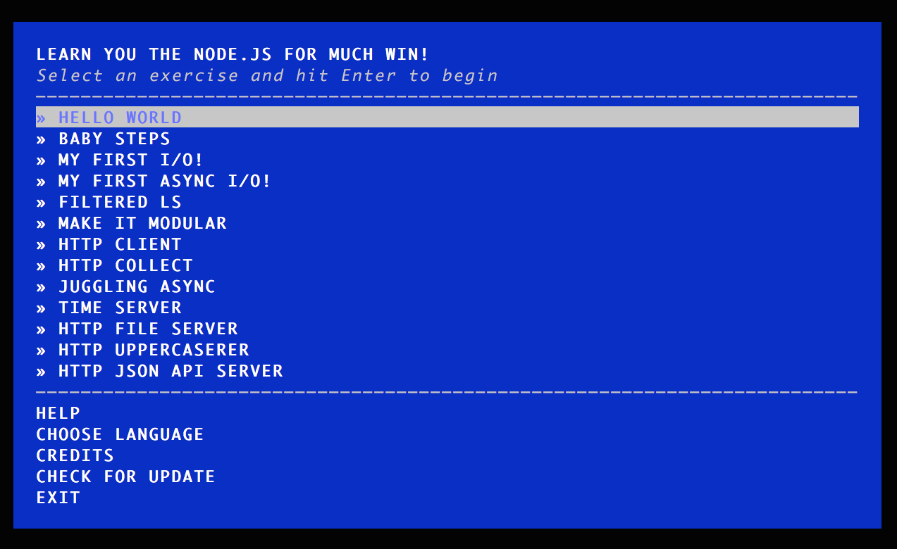

# Linux への Node 導入ガイド

このドキュメントは、Linux への Node の導入と利用を開始するための最初の手順を紹介します。


## Node のインストール

ここで紹介する Node のインストール対象 Linux ディストリビューションは Debian (あるいは Ubuntu) 系と Red Hat Enterprise Linux (あるいは CentOS, Fedora) です。Linux 向けの Node バイナリを提供している [NodeSource](https://nodesource.com/) リポジトリからのパッケージインストールを行います。

### Debian, Ubuntu

1 `curl` が利用できることを確認します。もしインストールされていない場合は、パッケージ情報を更新の上インストールを行います。

```
$ sudo apt-get update
$ sudo apt-get install curl
```

2 NodeSource リポジトリを登録します。ここでは LTS (Long-term Support, 長期サポート) バージョンである v4 系を指定しています。

```
$ curl -sL https://deb.nodesource.com/setup_4.x | sudo -E bash -
```

3 Node をインストールします

```
$ sudo apt-get install -y nodejs
```

> 最先端の Node プログラミングを試してみたい方は、LTS ではなく最新バージョン (現在は v6) をインストールしても構いません。ただし場合によっては一部 Nodeschool workshopper の動きが不安定になるなどのケースがあるかもしれません。また古いバージョンのディストリビューションを利用している場合は LTS のバイナリのみが用意されている場合もあります。

インストールが完了すると、プログラム実行のための `node` コマンドと、Node のパッケージマネージャプログラムである `npm` が利用可能になります。

目的 | コマンド
---- |  ----
Nodeプログラムの実行 | /usr/bin/node
Nodeパッケージマネージャ | /usr/bin/npm


### Red Hat Enterprise Linux, CentOS, Fedora

1 `curl` が利用できることを確認します。もしインストールされていない場合は、パッケージ情報を更新の上インストールを行います。

```
$ sudo yum update
$ sudo yum install curl
```

2 NodeSource リポジトリを登録します。ここでは LTS (Long-term Support, 長期サポート) バージョンである v4 系を指定しています。

```
$ curl --silent --location https://rpm.nodesource.com/setup_4.x | sudo bash -
```

3 Node をインストールします

```
$ sudo yum install -y nodejs
```

> 最先端の Node プログラミングを試してみたい方は、LTS ではなく最新バージョン (現在は v6) をインストールしても構いません。ただし場合によっては一部 Nodeschool workshopper の動きが不安定になるなどのケースがあるかもしれません。また古いバージョンのディストリビューションを利用している場合は LTS のバイナリのみが用意されている場合もあります。

インストールが完了すると、プログラム実行のための `node` コマンドと、Node のパッケージマネージャプログラムである `npm` が利用可能になります。

目的 | コマンド
---- |  ----
Nodeプログラムの実行 | /usr/bin/node
Nodeパッケージマネージャ | /usr/bin/npm


### それ以外の Linux ディストリビューション

他のディストリビューションをお使いの方は、Node 公式サイトの [Installing Node.js via package manager](https://nodejs.org/en/download/package-manager) のページが参考になるかもしれません。あるいは、[ダウンロードページ](https://nodejs.org/en/download/) から Linux バイナリをダウンロードして展開、もしくはソースコードからのビルドが可能です。


## 動作確認

ターミナルを起動します。`node -v` とタイプしてコマンドを実行してみると、Node のバージョンが表示されます。

```shell
$ node -v
v4.4.5
```

同じくターミナルで `npm` とタイプしてコマンド実行します。今度は Node パッケージマネージャ npm のコマンド解説が画面に表示されます。

```
$ npm

Usage: npm <command>

where <command> is one of:
    access, add-user, adduser, apihelp, author, bin, bugs, c,
    cache, completion, config, ddp, dedupe, deprecate, dist-tag,
    dist-tags, docs, edit, explore, faq, find, find-dupes, get,
    help, help-search, home, i, info, init, install, issues, la,
    link, list, ll, ln, login, logout, ls, outdated, owner,
    pack, ping, prefix, prune, publish, r, rb, rebuild, remove,
    repo, restart, rm, root, run-script, s, se, search, set,
    show, shrinkwrap, star, stars, start, stop, t, tag, team,
    test, tst, un, uninstall, unlink, unpublish, unstar, up,
    update, upgrade, v, version, view, whoami

npm <cmd> -h     quick help on <cmd>
npm -l           display full usage info
npm faq          commonly asked questions
npm help <term>  search for help on <term>
npm help npm     involved overview

Specify configs in the ini-formatted file:
    /home/sample/.npmrc
or on the command line via: npm <command> --key value
Config info can be viewed via: npm help config

npm@2.15.5 /usr/lib/node_modules/npm
```


## Nodeschool の workshopper をインストール

最後に、Nodeschoolで用意されている Node 学習のための workshopper をインストールしてみましょう。workshopper のインストールは、先ほど実行してみた Node パッケージマネージャの npm を使って行います。

ここでは、Node の基礎を学ぶことができる `learnyounode` という workshopper をインストールしてみましょう。ターミナル上で、次のようなコマンドを実行してください。

```
$ sudo npm install -g learnyounode
```

**今回実行したコマンドのポイント**

* `npm` は、プログラム実行時にサブコマンドをあわせて指定することで利用します。
* `npm install <package_name>` というコマンドで、指定した Node のパッケージをコンピュータへインストールすることができます。
* `-g` というオプションは「グローバルモード」を指定していて、パッケージのグローバルインストールを行います。これによって、そのパッケージに関連しているソースコードや実行プログラムなどが `/usr/local` 以下に保存されることになります。
* グローバルモードによるインストールで `/usr/local` 以下にファイルが保存されることになるため、`sudo` でコマンド実行しています。

実行に成功すれば、ターミナル画面にはインストールされた leanyounode パッケージと、そのパッケージが依存している関連パッケージがあわせてインストールされた旨が表示されます。

```
/usr/local/bin/learnyounode -> /usr/local/lib/node_modules/learnyounode/bin/learnyounode
learnyounode@3.5.3 /usr/local/lib/node_modules/learnyounode
├── duplexer@0.1.1
├── after@0.8.1
├── boganipsum@0.1.0
├── through@2.3.8
├── combined-stream@1.0.5 (delayed-stream@1.0.0)
├── through2-map@2.0.0 (xtend@4.0.1)
├── colors-tmpl@1.0.0 (colors@1.0.3)
├── workshopper-wrappedexec@0.1.2 (xtend@2.1.2)
├── concat-stream@1.5.1 (inherits@2.0.1, typedarray@0.0.6, readable-stream@2.0.6)
├── bl@1.1.2 (readable-stream@2.0.6)
├── through2@2.0.1 (xtend@4.0.1, readable-stream@2.0.6)
├── hyperquest@1.3.0 (duplexer2@0.0.2, through2@0.6.5)
├── rimraf@2.5.2 (glob@7.0.3)
├── workshopper-exercise@2.7.0 (tuple-stream@0.0.2, xtend@4.0.1, split@1.0.0, wcstring@2.1.1, chalk@1.1.3, i18n-core@2.1.1)
└── workshopper-adventure@4.6.2 (split@1.0.0, chalk@1.1.3, mkdirp@0.5.1, i18n-core@2.1.1, string-to-stream@1.1.0, simple-terminal-menu@1.1.3, msee@0.3.2, commandico@2.0.2, latest-version@2.0.0)
```

> 実行する時期により、表示されるパッケージのバージョン、および依存パッケージの内容そのものが異なる場合があります。

workshopper には、学習のための実行プログラムが梱包されています。 `learnyounode` というコマンドを実行してみましょう。

```
$ learnyounode
```

ターミナルには色鮮やかな画面が表示されましたか？



learnyounode は他言語対応しており、日本語で学習することができます。キーボードの上下キーを使って `CHOOSE LANGUAGE` までカーソルを動かしてリターンキーを押し、`Japanese (日本語)` を選択します。

さあ、Node 学ぶ準備が整いました。さっそく始めましょう！
